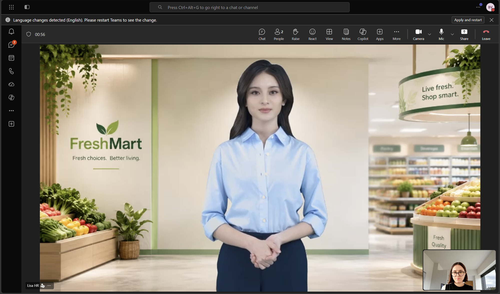
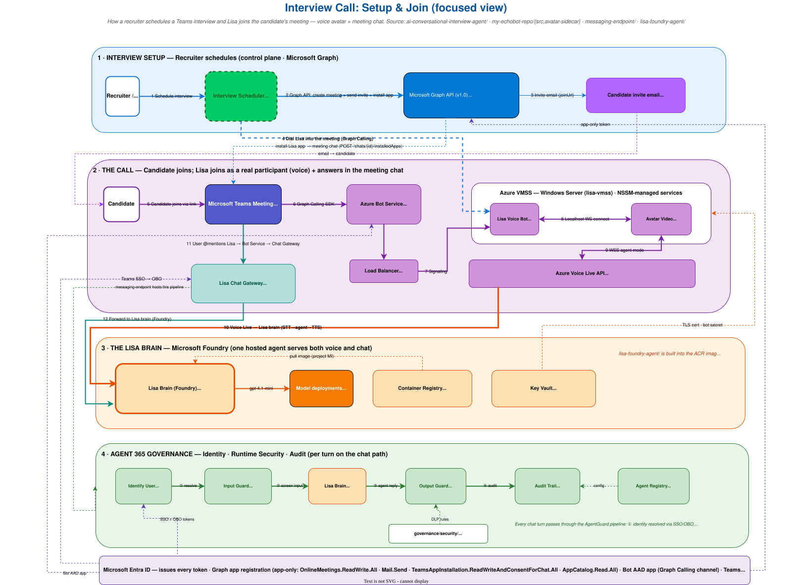
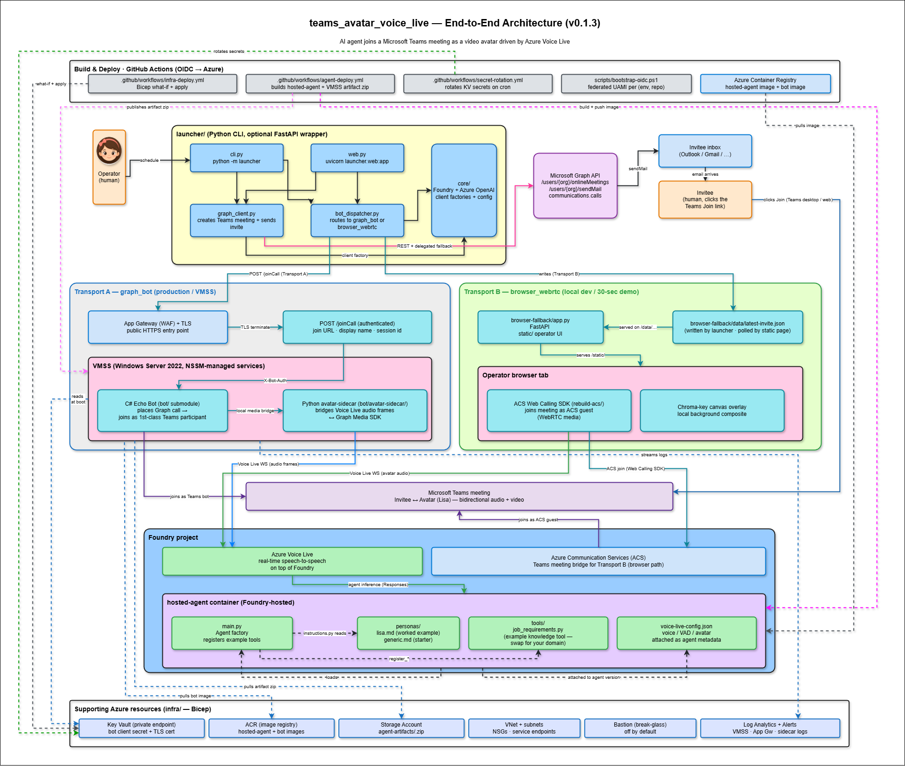

<div align="center">

# 🎙️ Teams Avatar Voice Live

### Put _any_ real-time voice AI agent into a Microsoft Teams meeting — as a governed, on-brand **video avatar**

Powered by **Azure Voice Live**&nbsp; ·&nbsp; persona = one Markdown file&nbsp; ·&nbsp; governance built in

<br />

[](https://github.com/glejdis/teams-avatar-voice-live/actions/workflows/python-tests.yml)
[](https://github.com/glejdis/teams-avatar-voice-live/actions/workflows/governance-validate.yml)
[](LICENSE)


<br />

[**Quickstart**](#quickstart)&nbsp; ·&nbsp; [**Architecture**](#what-you-get)&nbsp; ·&nbsp; [**Two transports**](#two-transports--both-shipped-your-choice)&nbsp; ·&nbsp; [**Governance**](#governance--the-avatar-is-a-first-class-governed-agent-identity)&nbsp; ·&nbsp; [**Personas**](#personas--lisa-is-just-the-example)

</div>

---

> 🙏 **Built on open source — original repo: [`glejdis/teams-avatar-bot`](https://github.com/glejdis/teams-avatar-bot).**
> The `graph_bot` transport is derived from the Microsoft Graph **EchoBot** community sample
> ([microsoft-graph-comms-samples](https://github.com/microsoftgraph/microsoft-graph-comms-samples/tree/master/Samples/PublicSamples/EchoBot))
> by [@bcage29](https://github.com/bcage29) & [@brwilkinson](https://github.com/brwilkinson), MIT-licensed, and
> vendored here as the [`bot/`](#repo-layout) submodule. Full credits in [Acknowledgements](#acknowledgements).

> **ℹ️ It's a platform, not an HR app.** It ships with **Lisa, an HR screener** as the worked
> example persona — swap her for support, sales (SDR), scheduling, or tutoring by editing one
> Markdown file. Lisa is the demo, **not the product**.

---

<div align="center">



<sub><b>Lisa in action</b> — the avatar agent joined as a first-class Teams participant, talking and listening live over Azure Voice Live.</sub>

<br /><br />

**▶️ Watch the demo** — Lisa runs a full FreshMart HR screening in a live Teams call:

<video src="https://github.com/glejdis/teams-avatar-voice-live/raw/main/docs/media/teams-avatar-demo.mp4" poster="https://github.com/glejdis/teams-avatar-voice-live/raw/main/docs/media/teams-avatar-demo-poster.jpg" controls muted width="900"></video>

<sub>Player not loading? <a href="https://github.com/glejdis/teams-avatar-voice-live/raw/main/docs/media/teams-avatar-demo.mp4">Open the video directly</a>.</sub>

</div>

---

## Why this repo?

Most "AI agent" projects hand you a chat box. **This one joins the meeting.** 🧑‍💻 ➡️ 🧑‍💼

It turns a real-time voice agent into a *first-class Teams participant* — it dials into
the call, **talks and listens live** over **Azure Voice Live** (interruptible
speech-to-speech, not brittle STT → LLM → TTS glue), renders a **video avatar**, and
replies in the meeting chat — with **every turn governed and audited**. And it's
deliberately built to be pulled apart and reused.

Why it's worth your time, technically:

- 🎙️ **Real-time, interruptible voice.** Barge-in and natural turn-taking come straight
  from Voice Live — a live conversation, not a walkie-talkie.
- 🧩 **Two transports, one env flag.** `TEAMS_JOIN_MODE=graph_bot` (C# Graph calling bot on
  Azure VMSS, production-grade) **or** `browser_webrtc` (ACS WebRTC — a **5-minute local
  demo: zero infra, no submodule**). Same agent brain; only *how it joins* changes.
- 📝 **Persona = one Markdown file.** Role, tone, and guardrails live in
  [`hosted-agent/personas/*.md`](hosted-agent/personas) and are loaded *verbatim* — no
  templating, no redeploy. Ship [`lisa.md`](hosted-agent/personas/lisa.md) (an HR
  screener), or drop in [`generic.md`](hosted-agent/personas/generic.md) and make it a
  support agent, SDR, or tutor by editing text.
- 🛡️ **Governance is code you can `grep`, not a policy PDF.** A CI gate
  ([`governance/validate_registry.py`](governance/validate_registry.py)) validates every
  agent against [`agent-registry.yaml`](governance/agent-registry.yaml) *before* merge; a
  runtime guard ([`agentgov/security/`](agentgov/security)) layers **PII/DLP redaction**,
  **prompt-injection screening**, **Entra-group entitlement checks**, and a **per-turn
  audit event** onto the live conversation.
- 🧠 **One brain, two front doors.** A single Azure AI Foundry hosted agent serves *both*
  the voice and the chat path — consistent answers, one thing to reason about.
- 🏗️ **Production-shaped, not a notebook.** Bicep IaC, VMSS, Key Vault, OIDC-based GitHub
  Actions deploys, scheduled secret rotation, and App Insights / Sentinel telemetry all
  ship in the box.

**Steal any layer:** the Voice Live wiring, the persona loader, or — the real gem — the
**agent-governance seam** (registry → CI gate → runtime guard → audit) that drops into
*any* agent stack, Teams or not.

## What you get





> **Editable source:** [`architecture.drawio`](docs/diagrams/architecture.drawio)
> (open at [app.diagrams.net](https://app.diagrams.net)).
> See [`docs/diagrams/README.md`](docs/diagrams/README.md) for details.

Prose walkthrough + request/response sequences: [`docs/architecture.md`](docs/architecture.md).

## Quickstart

```bash
git clone --recursive https://github.com/glejdis/teams-avatar-voice-live.git
cd teams-avatar-voice-live
python -m venv .venv && . .venv/bin/activate    # or .\.venv\Scripts\Activate.ps1 on Windows
pip install -e .[web]                            # core + launcher; web extras optional

cp .env.example .env
# Fill in GRAPH_* (Entra app + organiser mailbox object ID) at minimum.
# Optional: set BRAND_NAME=<Your Company> so invite emails read
# "Thank you for applying at <Your Company>" instead of the default "Contoso".

python -m launcher schedule \
    --to alice@example.com \
    --start +5 \
    --subject "Demo: Avatar Interview" \
    --mode browser_webrtc
```

For the **production VMSS path**, see [`docs/DEPLOY.md`](docs/DEPLOY.md).
For day-2 ops (cost control, troubleshooting), see [`docs/RUNBOOK.md`](docs/RUNBOOK.md).
To **recreate or tear down individual components** (bastion, VMSS, orphan PIPs) without redeploying the whole stack, see
[`infra/README.md#recover-individual-components`](infra/README.md#recover-individual-components).

## 30-second smoke test (the browser path)

Just want to *see* the avatar in a Teams meeting without setting up the
Graph app, OIDC, or VMSS? The browser-fallback path needs only an ACS
connection string and a Voice Live endpoint:

```bash
git clone https://github.com/glejdis/teams-avatar-voice-live.git
cd teams-avatar-voice-live/browser-fallback

python -m venv .venv && . .venv/bin/activate    # or .\.venv\Scripts\Activate.ps1
pip install -r requirements.txt

cp .env.example .env
# Fill in AZURE_VOICELIVE_ENDPOINT + AZURE_COMMUNICATION_CONNECTION_STRING.

python app.py                                   # serves http://localhost:3000
```

Open `http://localhost:3000` in Edge or Chrome (Teams calling rejects
`127.0.0.1`, so use `localhost`), paste any existing Teams meeting URL into
the field, and click **Join Teams**. The avatar joins as an ACS guest — no
bot registration, no Bicep deploy. See
[`browser-fallback/README.md`](browser-fallback/README.md) for the full env
var list and operator workflow.

## Two transports — both shipped, your choice

`teams_avatar_voice_live` ships **two** ways to put the avatar into a Teams
meeting. Pick by setting `TEAMS_JOIN_MODE=graph_bot|browser_webrtc` (or via
the `--mode` CLI flag).

| | **`graph_bot`** (VMSS Microsoft Graph calling bot) | **`browser_webrtc`** (ACS browser WebRTC) |
|---|---|---|
| **What it is** | A C# bot (from the `bot/` submodule) running on a Windows VMSS instance behind App Gateway. Joins Teams as a first-class meeting participant using Microsoft Graph Calls API. | A FastAPI app under `browser-fallback/` that hosts a single-page operator UI. Joins Teams as an ACS guest using the Azure Communication Services Web Calling SDK. |
| **Best for** | Production, enterprise demos, hands-off operation, multiple concurrent meetings, recordings | Local dev, laptop demos, "I need it working in 10 min", offline-of-public-internet scenarios |
| **Setup time** | ~1 hour bootstrap + 15 min per redeploy | ~5 min (`pip install` + `.env`) |
| **Azure resources** | VNet · Key Vault · VMSS · App Gateway + WAF · ACR · Bastion · Log Analytics (all in `infra/`) | None beyond the Foundry agent itself |
| **Bot/AAD prereqs** | Dedicated AAD bot app, Application Access Policy granting `Calls.JoinGroupCall.All` (up to 24 h to propagate), tenant admin approval | Just ACS connection string |
| **Operator effort per meeting** | None — bot dials in automatically when `launcher dispatch` runs | Click "Join Teams" in the browser (or enable auto-join checkbox) |
| **Concurrent meetings** | Many (instance scales out) | One per browser tab |
| **Cost when idle** | VMSS VM + App Gateway run 24/7 (~70 % saving if you stop overnight — see [RUNBOOK §1](docs/RUNBOOK.md#1-stop-the-stack-overnight-the-biggest-cost-lever)) | Zero (only avatar streaming meter while a tab is open) |
| **First-class Teams participant** | ✅ Yes — appears as `Lisa` in the roster, can be moderated, recorded by Teams compliance recording | ❌ No — ACS guest, "Limited call features" warning in Teams |
| **Lobby behaviour** | Configurable (default: bypass-everyone) | Subject to tenant policy — often forced into lobby for guests |
| **Patches needed** | None — bot uses Graph SDK directly | Yes — ACS browser SDK needs a small patch for `getMediaStream` (auto-applied by `browser-fallback/rebuild-acs/`) |
| **Network exposure** | Public FQDN with TLS termination at App Gateway | None — runs on `localhost:3000` |
| **Recommended for** | Anything that ships | Local iteration, persona tuning, "show this to a colleague tomorrow" |

If you're not sure: **start with `browser_webrtc`** to get a working demo in
minutes, then switch to `graph_bot` once you're past the persona / voice /
prompt-engineering loop.

## Personas — Lisa is just the example

**This is a general-purpose platform, not an HR tool.** The shipped persona is
**Lisa**, an HR screening assistant — the same one this codebase was originally
extracted from — but she is only a demonstration of the pattern. Her full prompt
lives in a single Markdown file:

```
hosted-agent/personas/lisa.md
```

To swap her for any other persona (customer support, sales SDR, scheduling
assistant, language tutor), either edit `lisa.md` in place, or write a new
file and point at it:

```bash
cp hosted-agent/personas/lisa.md hosted-agent/personas/support_agent.md
# edit support_agent.md
echo "PERSONA_FILE=personas/support_agent.md" >> hosted-agent/.env
```

See [`hosted-agent/personas/README.md`](hosted-agent/personas/README.md) for
authoring guidance and example fragments for non-HR roles.

## Repo layout

```
teams_avatar_voice_live/
├── core/              # client factories + AgentConfig (shared by launcher + agent)
├── launcher/          # CLI (`python -m launcher schedule …`) + optional FastAPI
│   ├── graph_client.py     # create Teams meeting, send invite email, invite bot
│   ├── bot_dispatcher.py   # one `dispatch(join_url, mode=…)` — routes to either transport
│   ├── cli.py / web.py     # front doors
│
├── hosted-agent/      # Foundry-hosted container — talks to Voice Live
│   ├── personas/      # editable Markdown persona files
│   └── tools/         # agent function tools (example: job_requirements)
│
├── bot/               # git submodule → glejdis/teams-avatar-bot (C# Graph bot + sidecar)
├── browser-fallback/  # ACS browser WebRTC operator UI (local dev)
├── agentgov/          # runtime governance seam (DLP · prompt-injection · audit · entitlement)
├── governance/        # agent registry + validator + DLP policy + inventory dashboard
├── infra/             # Bicep: VNet, KV, VMSS, App Gateway, monitor
├── scripts/           # bootstrap-oidc, vmss install/push, ops (cost control)
├── .github/workflows/ # infra-deploy, agent-deploy, secret-rotation, governance-validate, python-tests
└── docs/              # architecture · DEPLOY · RUNBOOK
```

## Governance — the avatar is a first-class, governed agent identity

Lisa takes free-form candidate speech and produces HR content, so the repo ships
a small **governance seam** that enforces controls *as code* and *inline on
every turn* — the same pattern a central Microsoft Purview + Defender + Entra
setup would apply, but runnable on a laptop and gated in CI:

| Layer | What it does | Where |
| --- | --- | --- |
| **Registry** | One governed identity per agent (owner, data exposure, least-privilege scopes, backing Entra identity, lifecycle) | [`governance/agent-registry.yaml`](governance/agent-registry.yaml) |
| **Policy-as-code gate** | Rejects over-broad Graph scopes, missing human oversight, ungated sensitive data; blocks inventory drift | [`governance/validate_registry.py`](governance/validate_registry.py) · `.github/workflows/governance-validate.yml` |
| **Runtime guard** | Screens prompt-injection, redacts PII (DLP), emits an attributable `AGENT_AUDIT` event every turn | [`agentgov/`](agentgov) |
| **Wired into both transports** | Agent Framework middleware (hosted agent) + transcript boundaries (browser fallback) | [`hosted-agent/`](hosted-agent) · [`browser-fallback/`](browser-fallback) |

```bash
pip install pyyaml
python governance/validate_registry.py            # policy-as-code gate
python governance/generate_inventory.py            # regenerate the dashboard
python -m unittest discover -s agentgov/tests -p "test_*.py"
```

See [`governance/README.md`](governance/README.md) for the full control list,
the runtime API, and the request → register → provision → retire lifecycle.

## Documentation

- [`docs/architecture.md`](docs/architecture.md) — components, sequence, region notes
- [`docs/DEPLOY.md`](docs/DEPLOY.md) — one-pager for the production VMSS rollout
- [`docs/RUNBOOK.md`](docs/RUNBOOK.md) — day-2 ops: cost control, demo flow, troubleshooting
- [`infra/README.md`](infra/README.md) — Bicep module reference, plus targeted recipes for [recovering individual components](infra/README.md#recover-individual-components) (bastion / VMSS / orphan PIPs) after cost cleanup

## Contributing

PRs welcome! 🎉 See **[CONTRIBUTING.md](CONTRIBUTING.md)** for the dev setup,
the checks CI runs (`ruff`, `pytest`, governance validation), and how to add a
persona. Please also read the **[Code of Conduct](CODE_OF_CONDUCT.md)**.

The fastest, highest-value contribution is a **new persona** — a persona is one
Markdown file. The content in `hosted-agent/personas/lisa.md` is deliberately
verbose so it works out of the box; if you write a tighter generic persona,
please send it in.

- 🙋 **Need help or have a question?** See **[SUPPORT.md](SUPPORT.md)** for where
  to file issues and get help.
- 🔒 **Found a security issue?** Please follow **[SECURITY.md](SECURITY.md)** —
  don't open a public issue.

## Acknowledgements

The **`graph_bot`** transport stands on prior open-source work:

- **[Microsoft Graph EchoBot sample](https://github.com/microsoftgraph/microsoft-graph-comms-samples/tree/master/Samples/PublicSamples/EchoBot)**
  — the C# Teams calling-bot foundation, by [@bcage29](https://github.com/bcage29) (Brennen Cage) and
  [@brwilkinson](https://github.com/brwilkinson) (Bruce Wilkinson). Vendored here as the [`bot/`](#repo-layout)
  submodule — original repo: **[`glejdis/teams-avatar-bot`](https://github.com/glejdis/teams-avatar-bot)**.
  MIT-licensed; the original copyright and licence are preserved in the submodule.
- **[Azure Deployment Framework (ADF)](https://github.com/brwilkinson/AzureDeploymentFramework)** by
  [@brwilkinson](https://github.com/brwilkinson) — the VMSS/DSC deployment tooling the EchoBot sample builds on.

These are community samples, **not official Microsoft products**.

### 🙌 Special thanks

- **[@LaetitiaMa1410](https://github.com/LaetitiaMa1410)** — for her invaluable
  support and collaboration in building this project up. Thank you! 💜

## Disclaimer

This is an independent, personal project — **not an official Microsoft product**
and not affiliated with or endorsed by Microsoft. It *uses* Azure, Microsoft
Teams, Microsoft Graph, and Azure AI Foundry via their public APIs. All
Microsoft names and logos are trademarks of Microsoft Corporation. See
**[DISCLAIMER.md](DISCLAIMER.md)** for details, and always obtain consent before
an AI agent joins, records, or transcribes a meeting.

## License

MIT — see [LICENSE](LICENSE).
